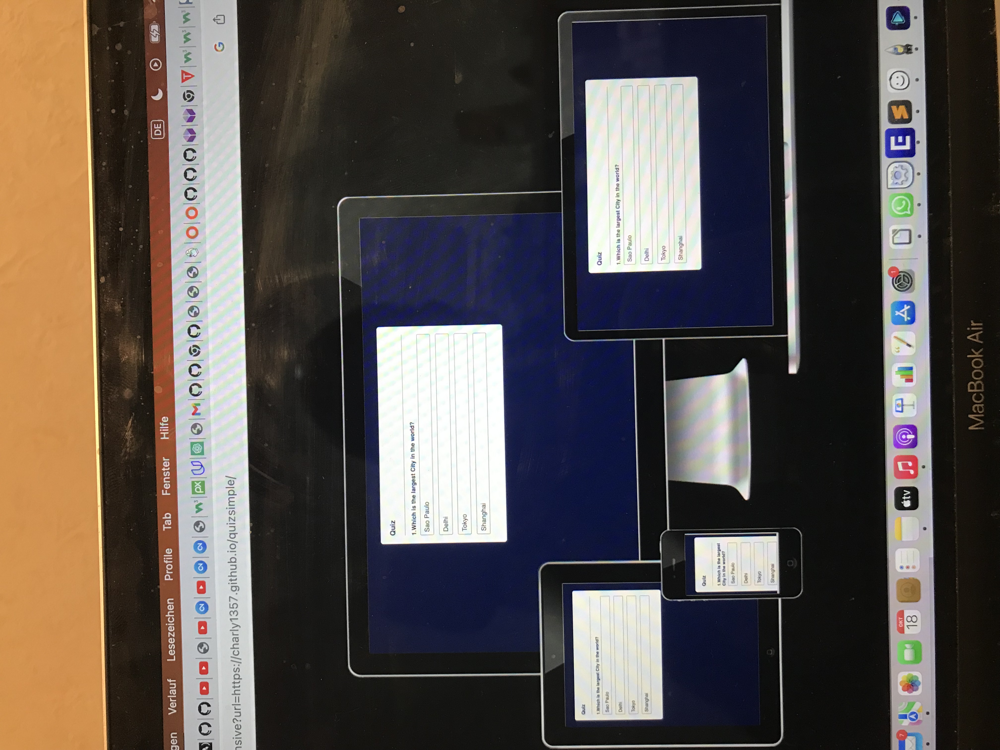
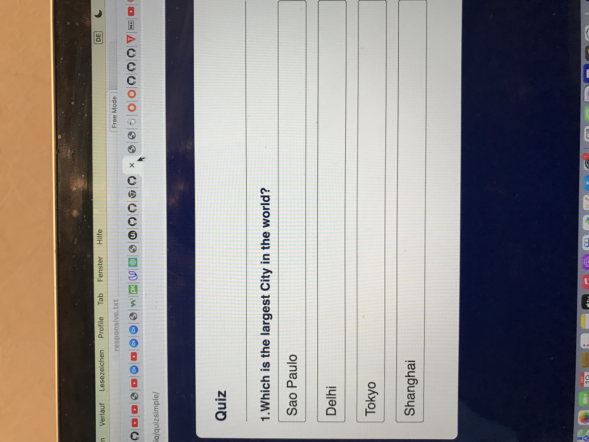
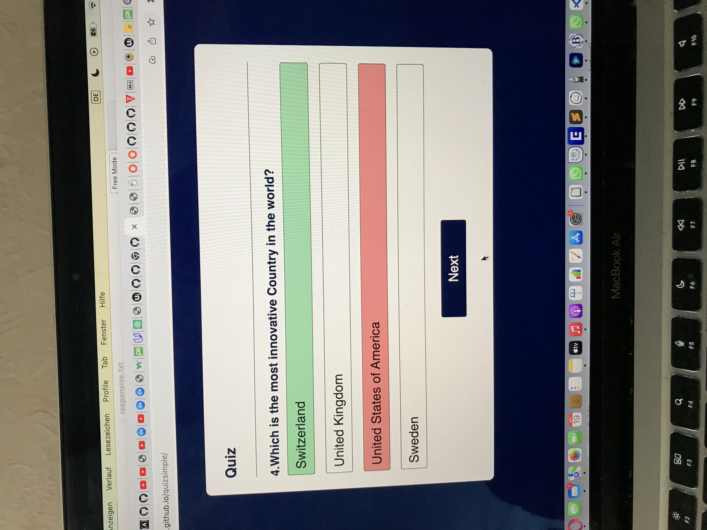
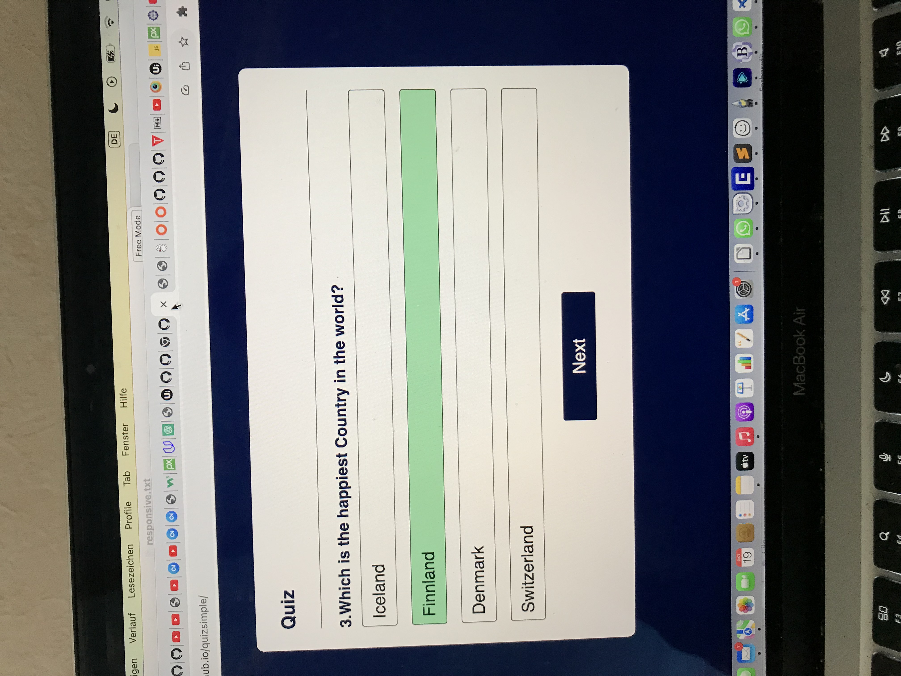
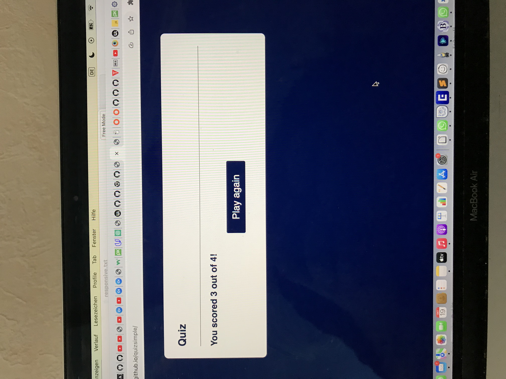

[Link to live site](https://charly1357.github.io/quizend)

# Index -Table of Contents

***

* Design

  * Wireframes
  * Font and Colours

* Features
  * Existing Features
  * Future Features
* UX
  * Goals
* Testing
  * Validator
  * Browser
  * Manual Testing
* Deployment

* Credits
  * Code

# Design
  
This is a quizsimple game .  
It has a very short Javascript Code to demostrate what is possible.  
There are four questions where each has four different answers.
You can only choose  once per question and the different
colors indicate if the answer was correct or wrong.
At the end it shows you the number of correct answer out of the total.

# Features

 At the top left is the Quiz heading

# The Game Area

In this part the user can see the Question and choose between
four different answers

# The question section

In this section the user can read the question
and the number  and choose between four  
different buttons the correct answer.
If the button is correct the background color changes to green.
otherwise  the background color changes to red and the correct
answer button is shown with a green background.
The buttons are disabled and the next buttons appears
After going through the four questions the user gets the result correct   
score is a point versus total score.  

# The Score Area

  * This area will allow the user to see exactly how many correct and   
  * and incorrect answers they have 
  

# Features Left to Implement

The user should be able to select between different topics the questions.

# Testing

The testing was done between several other people and since it is very
simple it didn´t  crash.

# Validator Testing

* HTML
  * Document checking completed. No errors or warnings to show.
  
* CSS
  * Document checking completed. No errors or warnings to show.  

* JAVA  
  * several errors 
    * 39:25 error 'document' is not defined
    * 40:23 / 41:20 /57:20the same 
  

# Credits 

* YouTube Create a Quiz with Timer using HTML CSS Javascript. 
* YouTube How to make a Quiz App using Javascript.  